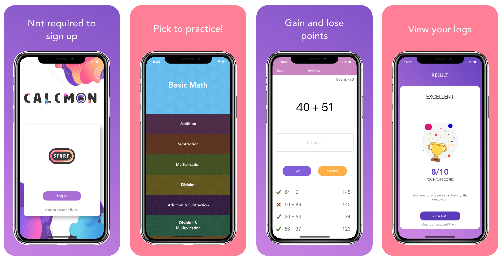

# Calcmon

A math based iOS app for users of all skill levels to improve their skills
Calcmon is a web-based game involving a virtual world with mini-math games/activities. The game can be played after a 
simple signup to setup your game user. It consists of multiple levels of calcumon battles against opponents. Attacks can be used through tokens, and players earn tokens via completing math problems within the game. 

## iOS Project
* [Github](https://github.com/SarinSwift/Calcumon)
* [Test Flight](https://testflight.apple.com/join/yPpkLj3G)

## Screen Casts

## Technologies Used
Xcode, Swift, UIKit, CocoaPods, UserDefaults  

## Website Project
* [Github](https://github.com/Coswold/Calcumon) 
* [Landing page](https://anisha7.github.io/Calcumon-website/?) 
* [Heroku App](http://calcumongame.herokuapp.com/)

## Authors

* **Sarin** - *Full stack iOS developer, UI and UX designer* - [SarinSwift](https://github.com/SarinSwift)
* **Lucia** - *iOS developer, back end developer* - [Lucia Reynoso](https://github.com/lvreynoso)
* **Anisha** - *Front end developer, Animation design* - [anisha7](https://github.com/Anisha7)
* **Connor** - *Back end developer* - [Coswold](https://github.com/Coswold)
* **Anna** - *Front end developer* - [Anna Pawl](https://github.com/AnniePawl)

---
### Contact Me
**Sarin Swift** *iOS Developer, UI and UX designer*\
Check my [GitHub profile](https://github.com/SarinSwift)\
Connect with me on [LinkedIn](https://www.linkedin.com/in/sarin-swift-98224816b/)\
Check my [Portfolio](https://www.makeschool.com/portfolio/Sarin-Swift)
